# Mission Control — Architecture

## Diagrama lógico de capas

### Mermaid Diagram

```mermaid
flowchart TB
    subgraph Client["CLIENT LAYER"]
        C1[React UI]
        C2[curl / Postman]
        C3[External scripts]
    end

    subgraph API["API LAYER — Next.js App Router"]
        A1[/api/workitems\nlist workitems\]
        A2[/api/logs\nlogs by workitem\]
        A3[/api/logs/recent\nrecent logs O(1)\]
        A4[/api/reports\nlist reports\]
        A5[/api/reports/view\nread report\]
        A6[/api/actions/*\nmove, update, ...\]
    end

    subgraph Server["SERVER LAYER"]
        subgraph CoreServices["Core Services"]
            S1[validate.ts\nID validation + safeResolve]
            S2[staleRuns.ts\nTTL detection + stale events]
            S3[recentIndex.ts\nO(1) index]
        end
        
        subgraph Orchestration["Orchestration"]
            S4[runs.ts\nRUNNING.json + TTL]
            S5[actionsApi.ts\norchestration + scripts]
            S6[logs.ts\nread/log + scan/fallback]
        end
        
        subgraph Execution["Execution"]
            S7[runScript.ts\nspawn scripts + structured log]
            S8[workitems.ts\nexport/import + contracts]
        end
    end

    subgraph Engine["ENGINE LAYER (immutable)"]
        E1[scripts/wi-*.sh\nbash scripts]
        E2[index/workitems.json\ncanonical export]
        E3[reports/<ID>/*.md\nengine outputs]
    end

    subgraph Filesystem["FILESYSTEM"]
        F1[logs/<ID>/*.json]
        F2[logs/<ID>/RUNNING.json]
        F3[logs/index/recent.json]
    end

    Client -->|HTTP| API
    API -->|internal calls| Server
    S7 -->|filesystem / spawn| Engine
    Server -->|read/write| Filesystem
```

## Flujo de datos típico (action: move)

1. **Client** → POST `/api/actions/move` { id, to }
2. **API** → parse body, validate ID (strict/fallback)
3. **Server** → `actionsApi.executeActionWithExport()`
4. **Server** → `runScript('wi-move.sh', ['--id', id, '--to', to])`
5. **Engine** → ejecuta script bash, modifica filesystem workitems
6. **Engine** → `wi-export.sh` regenera `index/workitems.json`
7. **Server** → lee export, retorna `WorkItemsData`
8. **Server** → `writeStructuredLog()` + `appendToRecentIndex()`
9. **API** → responde con contrato estándar (+ `id_validation`)

## Single Points of Failure

| Componente | Riesgo | Mitigación |
|------------|--------|------------|
| Filesystem `logs/` | corrupción, llenado | TTL + trimming, atomic writes |
| `RUNNING.json` | zombie lock | TTL detection + stale event |
| Engine scripts | falla silenciosa | stdout/stderr capture, exit codes |
| `index/workitems.json` | desync | Regeneración post-action |

## Trade-offs clave

### Exec vs Spawn
- **Decisión**: `child_process.exec` sincrónico con timeout
- **Alternativa**: spawn con streams
- **Trade-off**: Simplicidad vs memoria en outputs grandes
- **Mitigación**: timeout configurable, stdout/stderr capturados

### Filesystem vs Database
- **Decisión**: Filesystem nativo (JSON logs)
- **Alternativa**: SQLite/PostgreSQL
- **Trade-off**: Zero-config vs consistencia transaccional
- **Mitigación**: atomic writes (tmp+rename), validación estricta de paths

### O(1) Index vs Full Scan
- **Decisión**: Índice incremental `recent.json` con fallback a scan
- **Alternativa**: Siempre scan
- **Trade-off**: Complejidad de mantenimiento vs latencia
- **Mitigación**: Self-healing (rebuild automático si index corrupto)

## Qué es reusable vs específico Brokia

### Componentes genéricos (reusables)
- `validate.ts`: ID validation, path safety
- `recentIndex.ts`: Incremental index pattern
- `staleRuns.ts`: TTL detection for process locks
- Multiagent orchestration protocol

### Componentes específicos Brokia
- Estructura de workitems (IDEA-*, FEATURE-*, etc.)
- Scripts `wi-*.sh` canonizados
- Estados del pipeline (NEW → RESEARCHING → ...)
- Campos de `WorkItemsData` (impact, effort, clarification_status)

## Conectividad dependiente

```
Mission Control ──depende──> Engine workitems (brokia/workitems/)
        │
        ├──lee──> logs/<ID>/*.json
        ├──escribe──> logs/<ID>/RUNNING.json
        ├──lee──> index/workitems.json (generado por engine)
        └──spawn──> scripts/wi-*.sh (engine)
```

### Dependency Graph (Mermaid)

```mermaid
graph LR
    MC[Mission Control] -->|depends on| Engine[Engine workitems]
    
    MC -->|reads| L1[logs/<ID>/*.json]
    MC -->|writes| L2[logs/<ID>/RUNNING.json]
    MC -->|reads| L3[index/workitems.json]
    MC -->|spawns| Scripts[scripts/wi-*.sh]
    
    Scripts --> Engine
    L3 -. generated by .-> Engine
```



## Escalabilidad prevista

| Métrica | v1.3.x | Límite conocido |
|---------|--------|-----------------|
| Workitems | ~1000 | Filesystem dir limits |
| Logs/item | ~1000 | index/recent.json size |
| Recent query | O(1) | 100 items (configurable) |
| Concurrent runs | ~10 | TTL + stale detection |
