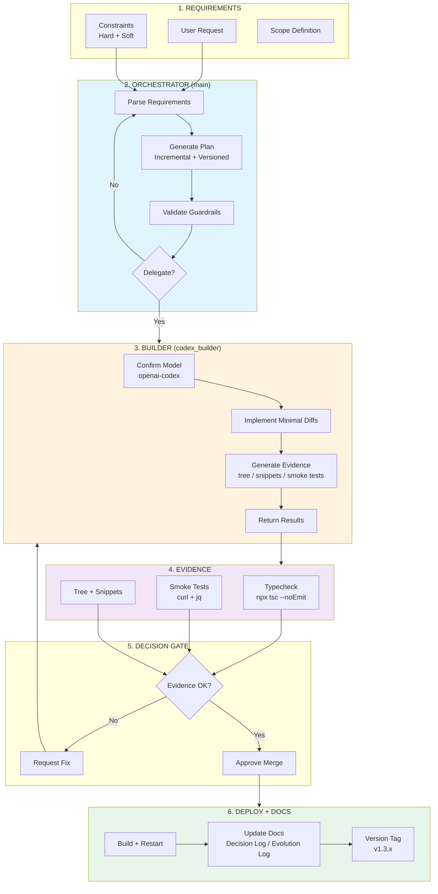

# Mission Control — Multiagent Framework

## Propósito

Este documento formaliza el **marco metodológico multiagente** utilizado en Mission Control. El objetivo no es “usar IA”, sino **diseñar un proceso reproducible** de desarrollo asistido por IA con control humano, evidencia, y gobernanza técnica.

> **Principio central:** la IA no reemplaza decisiones técnicas; las **instrumenta** con rigor y trazabilidad.

---

## Roles definidos

### 1) Orquestador (main)

**Responsabilidad:** coordinar el proceso, definir planes, validar restricciones y sintetizar resultados.

**Funciones clave:**
- Interpreta requerimientos y restricciones
- Genera plan de ejecución incremental
- Spawnea agentes especializados (builder/researcher)
- Valida evidencia (snippets, tests, smoke tests)
- Mantiene el contrato “no breaking”

**Criterio:** no delega si la tarea es simple; delega solo cuando hay riesgo técnico alto o cambios en código.

---

### 2) Builder (codex_builder)

**Responsabilidad:** ejecutar cambios de código con alta precisión y mínima desviación.

**Funciones clave:**
- Implementar tareas puntuales con constraints estrictas
- Escribir diffs mínimos
- Aportar evidencia: tree, snippets, comandos ejecutados
- Confirmar modelo (openai-codex/gpt-5.3-codex) antes de editar

**Criterio:** nunca decide scope; solo implementa lo especificado.

---

## STOP‑THE‑BLEED Protocol

Protocolo aplicado cuando se detecta riesgo crítico (seguridad, data loss, path traversal, locks zombies):

1. **Freeze scope**: no introducir features nuevos
2. **Patch minimalista**: corregir solo el vector crítico
3. **Evidence-based**: demostrar fix con smoke tests
4. **No breaking changes**: solo additive
5. **Documentación inmediata**: registrar en decision log + evolution log

**Ejemplo aplicado:** v1.3.1 hardening (validate + safeResolve + TTL)

---

## Scope Locking

Regla: **el scope se congela antes de tocar código**. Se prioriza:

- Claridad de objetivos
- Definición explícita de restricciones
- Aprobación del plan antes de ejecución

En Mission Control:
- “NO tocar engine” es una hard rule
- “No breaking API contract” es una hard rule

---

## Guardrails: Hard vs Soft

| Tipo | Definición | Ejemplo |
|------|-----------|---------|
| **Hard** | No se puede violar | “No modificar brokia/workitems/**” |
| **Soft** | Preferencia, negociable | “Minimizar cambios” |

**Aplicación:** cada request de implementación comienza con una sección de restricciones duras. Los agentes deben respetarlas explícitamente.

---

## Evidence‑based Implementation

Ningún cambio se considera válido sin evidencia explícita. La evidencia mínima incluye:

- Tree de archivos modificados
- Snippets representativos (≤80 líneas)
- Smoke tests relevantes
- `npx tsc --noEmit` clean

Esto convierte la implementación en un **proceso auditable**.

---

## Smoke Tests obligatorios

Los smoke tests son **parte del contrato**. No son opcionales.

Ejemplos:
- /api/logs traversal blocking
- /api/logs/recent O(1) index fallback
- RUNNING stale detection → event log

---

## No Big‑Bang Refactors

Toda evolución es incremental, con versiones pequeñas:

- v1.3.1: hardening
- v1.3.2: index O(1)
- v1.3.3: observability

Regla: **cambios pequeños + evidencia** superan refactors masivos.

---

## Versioning incremental

Cada versión tiene:

1. **Problema detectado**
2. **Decisión tomada**
3. **Alternativas consideradas**
4. **Riesgos mitigados**
5. **Evidencia**

Este formato permite rastrear la evolución del sistema como un **experimento académico**.

---

## Por qué este marco es académico (no ad‑hoc)

**Ad‑hoc IA**: prompts sueltos → cambios impredecibles → sin trazabilidad.

**Marco multiagente**:
- Roles definidos
- Gobernanza estricta
- Evidencia obligatoria
- Control humano de decisiones
- Evolución incremental documentada

**Resultado:** la IA se convierte en herramienta metodológica, no en reemplazo del diseño.

---

## Workflow Diagram (Mermaid)

## Checklist operativo (resumen)

- [ ] Scope congelado y validado
- [ ] Guardrails hard confirmados
- [ ] Plan aprobado
- [ ] Builder implementa cambios mínimos
- [ ] Evidencia generada (tree/snippets/tests)
- [ ] Documentación actualizada
- [ ] Release versionada

---

## Conclusión

Mission Control demuestra que un enfoque multiagente **no es improvisación**, sino un proceso técnico riguroso. El valor académico proviene de la trazabilidad entre decisión → implementación → evidencia → evolución.
