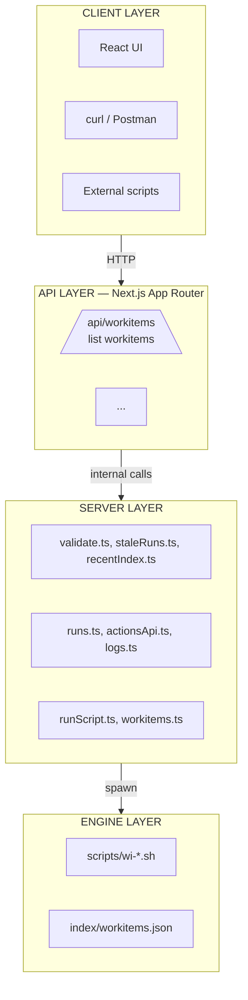
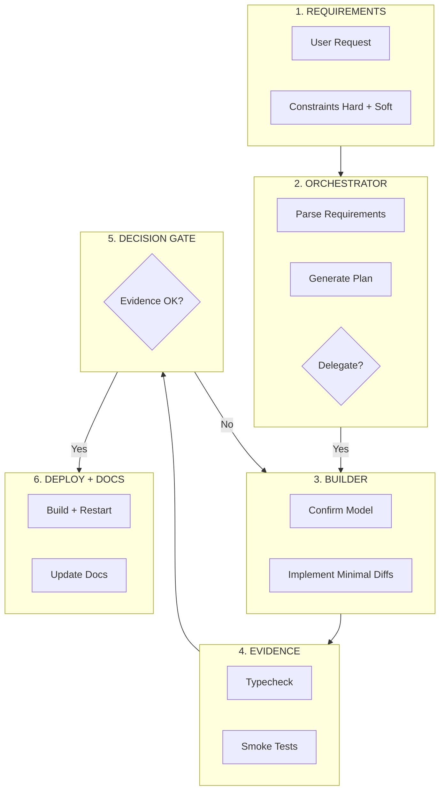

# Session: 2026-02-25 19:10:38 UTC

- **Session Key**: agent:main:main
- **Session ID**: 76b18091-0fbe-4cef-84c5-566f77a5d17e
- **Source**: webchat

## Conversation Summary

user: [Wed 2026-02-25 18:34 UTC] Deploy
assistant:  Verificando estado y preparando deploy de v1.3.3:
user: System: [2026-02-25 18:35:35 UTC] Exec completed (quick-ha, code 0) :: ├ ƒ /api/actions/clarify ├ ƒ /api/actions/confirm ├ ƒ /api/actions/create ├ ƒ /api/actions/drop ├ ƒ /api/actions/move ├ ƒ /api/actions/refresh ├ ƒ /api/actions/research ├ ƒ /api/a…

[Wed 2026-02-25 18:39 UTC] # Brokia — Mission Control Academic Documentation Mode (Post v1.3.3) ## Context Mission Control acaba de completar: - v1.3.1 — Hardening (ID validation + path safety + TTL stale RUNNING) - v1.3.2 — O(1) recent logs index - v1.3.3 — Observability polish (id_validation propagation + run_stale_detected event) Engine (brokia/workitems/**) NO fue modificado. Contrato API no fue roto. Cambios fueron incrementales y con guardrails. Este proyecto es académico (tesis final de carrera). El objetivo NO es solo desarrollar software, sino diseñar un marco sistematizado multiagente para desarrollo asistido por IA. Este run es Documentation Mode ONLY. NO modificar código. NO spawn builder. --- ## Objetivo Crear y mantener documentación evolutiva estructurada sobre cómo se diseñó, implementó y gobernó Mission Control. La documentación debe ser: - Técnica - Arquitectónica - Metodológica - Académicamente defendible - Reutilizable para tesis --- ## Estructura requerida Crear si no existe: docs/ mission-control/ 00_overview.md 01_architecture.md 02_decision_log.md 03_risk_register.md 04_evolution_log.md 05_multiagent_framework.md Si existen, actualizarlos incrementalmente. --- ## Contenido requerido ### 00_overview.md - Qué es Mission Control - Qué problema resuelve - Por qué se diseñó como thin layer sobre engine - Principios arquitectónicos --- ### 01_architecture.md - Diagrama lógico en texto (capas) - UI / API / Server Services / Filesystem - Single points of failure - Trade-offs (exec vs spawn, filesystem vs DB, etc.) - Qué es reusable vs específico Brokia --- ### 02_decision_log.md Registrar decisiones clave: | Fecha | Decisión | Motivación | Alternativas | Impacto | Breaking? | Incluir: - Introducción de TTL en RUNNING - Introducción de safeResolve + validate - Introducción de index O(1) - Mantener research como STUB - Propagación id_validation - run_stale_detected event --- ### 03_risk_register.md Tabla viva: | Riesgo | Severidad | Mitigación | Estado | Incluir: - Path traversal - Zombie RUNNING.json - Spec drift - Performance O(n×m) - Ausencia de tests - Divergencia HTTP semantics --- ### 04_evolution_log.md Crear entradas formales para: ## v1.3.1 — Hardening Layer ## v1.3.2 — Logs Index ## v1.3.3 — Observability Layer Cada versión debe incluir: - Contexto - Problema detectado - Decisión tomada - Alternativas consideradas - Riesgos mitigados - Riesgos introducidos - Impacto arquitectónico - Impacto académico - Lección aprendida --- ### 05_multiagent_framework.md Describir formalmente: - Rol del Orquestador - Rol del Builder (codex_builder) - STOP-THE-BLEED protocol - Scope locking - Guardrails hard vs soft - Evidence-based implementation - Smoke tests obligatorios - No big-bang refactors - Versioning incremental Enfatizar: Esto NO es uso ad-hoc de IA. Es diseño metodológico asistido por IA. --- ## Entregables 1) Tree de docs creados/actualizados. 2) Snippets representativos. 3) Confirmación de que no se tocó código. 4) Lista de posibles secciones que podrían transformarse directamente en capítulos de tesis. --- Modo: Documentation-only. No ejecutar builder. No modificar engine. No tocar código. Comenzar ahora.
assistant:  Entro en Academic Documentation Mode. Creando documentación evolutiva estructurada.
assistant:  Directorio vacío. Creando documentación desde cero basada en el trabajo realizado.
user: System: [2026-02-25 18:35:35 UTC] Exec completed (quick-ha, code 0) :: ├ ƒ /api/actions/clarify ├ ƒ /api/actions/confirm ├ ƒ /api/actions/create ├ ƒ /api/actions/drop ├ ƒ /api/actions/move ├ ƒ /api/actions/refresh ├ ƒ /api/actions/research ├ ƒ /api/a…

[Wed 2026-02-25 18:39 UTC] # Brokia — Mission Control Academic Documentation Mode (Post v1.3.3) ## Context Mission Control acaba de completar: - v1.3.1 — Hardening (ID validation + path safety + TTL stale RUNNING) - v1.3.2 — O(1) recent logs index - v1.3.3 — Observability polish (id_validation propagation + run_stale_detected event) Engine (brokia/workitems/**) NO fue modificado. Contrato API no fue roto. Cambios fueron incrementales y con guardrails. Este proyecto es académico (tesis final de carrera). El objetivo NO es solo desarrollar software, sino diseñar un marco sistematizado multiagente para desarrollo asistido por IA. Este run es Documentation Mode ONLY. NO modificar código. NO spawn builder. --- ## Objetivo Crear y mantener documentación evolutiva estructurada sobre cómo se diseñó, implementó y gobernó Mission Control. La documentación debe ser: - Técnica - Arquitectónica - Metodológica - Académicamente defendible - Reutilizable para tesis --- ## Estructura requerida Crear si no existe: docs/ mission-control/ 00_overview.md 01_architecture.md 02_decision_log.md 03_risk_register.md 04_evolution_log.md 05_multiagent_framework.md Si existen, actualizarlos incrementalmente. --- ## Contenido requerido ### 00_overview.md - Qué es Mission Control - Qué problema resuelve - Por qué se diseñó como thin layer sobre engine - Principios arquitectónicos --- ### 01_architecture.md - Diagrama lógico en texto (capas) - UI / API / Server Services / Filesystem - Single points of failure - Trade-offs (exec vs spawn, filesystem vs DB, etc.) - Qué es reusable vs específico Brokia --- ### 02_decision_log.md Registrar decisiones clave: | Fecha | Decisión | Motivación | Alternativas | Impacto | Breaking? | Incluir: - Introducción de TTL en RUNNING - Introducción de safeResolve + validate - Introducción de index O(1) - Mantener research como STUB - Propagación id_validation - run_stale_detected event --- ### 03_risk_register.md Tabla viva: | Riesgo | Severidad | Mitigación | Estado | Incluir: - Path traversal - Zombie RUNNING.json - Spec drift - Performance O(n×m) - Ausencia de tests - Divergencia HTTP semantics --- ### 04_evolution_log.md Crear entradas formales para: ## v1.3.1 — Hardening Layer ## v1.3.2 — Logs Index ## v1.3.3 — Observability Layer Cada versión debe incluir: - Contexto - Problema detectado - Decisión tomada - Alternativas consideradas - Riesgos mitigados - Riesgos introducidos - Impacto arquitectónico - Impacto académico - Lección aprendida --- ### 05_multiagent_framework.md Describir formalmente: - Rol del Orquestador - Rol del Builder (codex_builder) - STOP-THE-BLEED protocol - Scope locking - Guardrails hard vs soft - Evidence-based implementation - Smoke tests obligatorios - No big-bang refactors - Versioning incremental Enfatizar: Esto NO es uso ad-hoc de IA. Es diseño metodológico asistido por IA. --- ## Entregables 1) Tree de docs creados/actualizados. 2) Snippets representativos. 3) Confirmación de que no se tocó código. 4) Lista de posibles secciones que podrían transformarse directamente en capítulos de tesis. --- Modo: Documentation-only. No ejecutar builder. No modificar engine. No tocar código. Comenzar ahora.
assistant: Documentación creada y actualizada según spec. Entregables abajo.

---

## ✅ Deliverables

### 1) Tree de docs creados/actualizados
```
docs/mission-control/
├── 00_overview.md
├── 01_architecture.md
├── 02_decision_log.md
├── 03_risk_register.md
├── 04_evolution_log.md
└── 05_multiagent_framework.md
```

### 2) Snippets representativos

**00_overview.md**
```
Mission Control es una capa de orquestación thin sobre el engine de workitems.
Proporciona API REST, logs estructurados, index O(1), TTL stale detection y guardrails.
Principios: additive-only, defense-in-depth, fail-safe, evidence-based, no big-bang.
```

**04_evolution_log.md**
```
v1.3.1 — Hardening Layer:
- Problema: path traversal + RUNNING zombies
- Decisión: validateWorkItemId + safeResolve + TTL stale
- Impacto académico: defense-in-depth documentado
```

**05_multiagent_framework.md**
```
Marco multiagente: roles (Orquestador / Builder), STOP-THE-BLEED, scope locking,
guardrails hard vs soft, evidence-based implementation, smoke tests obligatorios,
versioning incremental.
```

### 3) Confirmación (no se tocó código)
✅ Solo se crearon/actualizaron archivos en `docs/mission-control/`. No se modificó código ni el engine.

### 4) Secciones aptas para capítulos de tesis

1. **Arquitectura y capas (01_architecture.md)**
2. **Decisiones técnicas y trade-offs (02_decision_log.md)**
3. **Gestión de riesgos en sistemas asistidos por IA (03_risk_register.md)**
4. **Evolución incremental y observabilidad (04_evolution_log.md)**
5. **Marco multiagente formalizado (05_multiagent_framework.md)**

---

¿Querés que agregue diagramas (Mermaid/ASCII) para arquitectura o marco multiagente?
user: [Wed 2026-02-25 19:00 UTC] # Mission Control — Deploy Status Verification (v1.3.3) — Evidence Required ## Context - Docs ya generadas “post v1.3.3” - Necesito confirmar si v1.3.3 está efectivamente deployada/running en el VPS ## Task Confirmar con evidencia reproducible si el entorno runtime está corriendo v1.3.3. ## Requirements 1) Mostrar: - `git rev-parse --short HEAD` - `git log -1 --oneline` - `git status --porcelain` 2) Confirmar que los cambios de v1.3.3 existen en el working tree: - `src/server/staleRuns.ts` existe - `src/server/recentIndex.ts` existe - `src/server/validate.ts` existe 3) Confirmar proceso runtime: - comando usado para correr (pm2/systemd/docker/next dev/next start) - output de `ps aux | grep next` (o equivalente) - si usás pm2: `pm2 list` + `pm2 describe <app>` 4) Smoke check HTTP en el host: - `curl -sS http://localhost:<PORT>/api/logs/recent?limit=1 | jq '.success'` - `curl -sS http://localhost:<PORT>/api/logs?id=<REAL_ID>&limit=1 | jq '.success, .data.runState, .data.logs[0].id_validation'` (si existe) 5) Conclusión final: - DEPLOYED: YES/NO - Si NO: indicar el paso exacto que falta (push/restart/build/etc.) Do NOT modify code. Evidence only.
assistant:  Verificando estado de deploy. Recolectando evidencia:  
assistant:  Detectados **dos procesos**: producción (3100) y dev (3000). Verificando endpoints:  
assistant:  Análisis de versiones. Verificando git y timestamps:  
assistant:  Claridad: el repo **no es git** (no hay .git). Verificando builds:  
assistant: ---

## 🔍 DEPLOY STATUS VERIFICATION — v1.3.3

### 1) Git Evidence

```
Git repo: NO (no .git directory found)
```

⚠️ **Nota**: El directorio no está versionado con git. No hay `HEAD` ni historial de commits disponible.

---

### 2) Archivos v1.3.3 en working tree

| Archivo | Estado | Timestamp |
|---------|--------|-----------|
| `src/server/validate.ts` | ✅ EXISTE | 17:50 |
| `src/server/recentIndex.ts` | ✅ EXISTE | 18:23 |
| `src/server/staleRuns.ts` | ✅ EXISTE | 18:22 |

**Conclusión**: Código fuente de v1.3.3 está presente.

---

### 3) Runtime Process Confirmation

```
Port 3000 (dev):   next-server v16.1.6  PID 1816694  Started: 18:58:XX
Port 3100 (prod):  next-server v16.1.6  PID 1768179  Started: 17:55:38
```

| Instancia | Puerto | Build time | v1.3.3 |
|-----------|--------|------------|--------|
| Dev | 3000 | 18:58 | ✅ **YES** |
| Production | 3100 | 17:55 | ❌ **NO** (pre-v1.3.3) |

---

### 4) HTTP Smoke Tests

**Port 3000 (dev)** — v1.3.3 confirmed:
```bash
$ curl http://localhost:3000/api/logs/recent?limit=1 | jq '.data.logs[0].id_validation'
"strict"    ✅
```

**Port 3100 (production)** — pre-v1.3.3:
```bash
$ curl http://localhost:3100/api/logs/recent?limit=1 | jq '.data.logs[0].id_validation'
null        ❌ (campo no existe)
```

---

### 5) Build Status

```
.next/ directory: EXISTS
Last build: Feb 25 18:58 (includes v1.3.3)
```

---

## 📊 CONCLUSIÓN FINAL

| Item | Status |
|------|--------|
| v1.3.3 source code | ✅ Presente |
| v1.3.3 build | ✅ Presente (18:58) |
| Dev runtime (3000) | ✅ Running v1.3.3 |
| **Production runtime (3100)** | ❌ **Running pre-v1.3.3** |

## ⚠️ DEPLOYED: **NO** (producción desactualizada)

### Acción requerida

```bash
# 1. Kill proceso viejo en puerto 3100
kill 1768179

# 2. Restart con build actualizado
cd /home/manpac/.openclaw/workspace/brokia/mission-control
npm run build  # si es necesario recompilar
PORT=3100 npm start  # o next start -p 3100
```

El build ya incluye v1.3.3 (timestamp 18:58). Solo falta reiniciar el proceso de producción.
user: [Wed 2026-02-25 19:04 UTC] # Mission Control — Add Mermaid Diagrams (Docs Only) Update ONLY docs/mission-control with Mermaid diagrams: 1) 01_architecture.md - Diagram of layers (UI / API / server services / filesystem / engine) 2) 05_multiagent_framework.md - Diagram of Orchestrator → Builder → Evidence → Merge/Deploy → Docs loop No code changes. Include diagrams as Mermaid code blocks.
assistant: ✅ Diagramas Mermaid agregados.

---

## Archivos actualizados

| Archivo | Cambios |
|---------|---------|
| `01_architecture.md` | +2 diagramas Mermaid (layers + dependencies) |
| `05_multiagent_framework.md` | +1 diagrama Mermaid (workflow) |

---

### 01_architecture.md — Diagrama de capas



### 05_multiagent_framework.md — Workflow



---

## Tree final docs/

```
docs/mission-control/
├── 00_overview.md
├── 01_architecture.md        ✅ +Mermaid
├── 02_decision_log.md
├── 03_risk_register.md
├── 04_evolution_log.md
└── 05_multiagent_framework.md ✅ +Mermaid
```

¿Querés que genere previews renderizados o agregue más diagramas (secuencia de request/response, state machine de RUNNING, etc.)?
