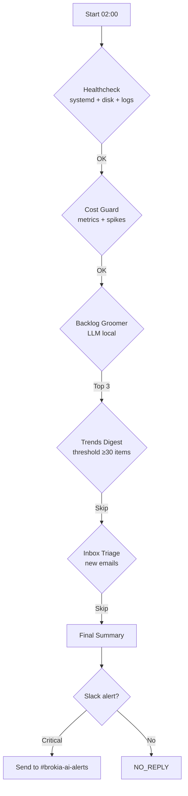

# Workflow: Nightly Ops

Proactive but cost‑controlled nightly pipeline that detects issues, suggests improvements, and generates a consolidated report—without running all night or wasting tokens.

## Cost Rules (Mandatory)
- **Nightly budget:** max 1 cloud LLM call (ideally 0).
- **Prefer local LLM** (phi3:mini) and/or rule‑based logic.
- **If no value signals**, skip heavy tasks.
- **Each sub‑task has timeout and early‑exit.**

## Schedule
```bash
02:00 nightly_healthcheck
02:10 nightly_cost_guard
02:20 nightly_backlog_groomer
02:40 trends_digest  (only if ≥30 new items since last run)
03:10 inbox_triage   (only if new relevant emails exist)
03:30 final_summary  (aggregate all outputs)
```

## Pipeline Overview


## Tasks

### 1. Healthcheck (no LLM)
**Checks:**
- `systemd status`: openclaw‑gateway, ollama (if installed), cron workers.
- CPU/RAM/Disk usage (last 24h).
- Last 200 error logs (keywords: `ERROR`, `CRITICAL`, `failed`).
- OpenClaw gateway reachable (`openclaw status`).

**Output:** `reports/nightly/health_YYYY‑MM‑DD.md`

**Timeout:** 2 minutes.

**Early exit:** If gateway is down, send immediate Slack alert and stop pipeline.

### 2. Cost Guard (no LLM or minimal local LLM)
**Analysis:**
- Review logs/metrics of requests (last 7 days).
- Detect spikes in token usage, API calls, execution time.
- Suggest actions:
  - Lower frequency of cron jobs.
  - Increase cache TTL.
  - Switch model (e.g., from cloud to local).
  - Disable non‑essential tasks.

**Output:** `reports/nightly/cost_guard_YYYY‑MM‑DD.md`

**Timeout:** 3 minutes.

**Early exit:** If cost spike >50% vs baseline, flag for immediate review.

### 3. Backlog Groomer (local LLM allowed)
**Inputs:**
- `improvement_opportunities.md`
- `agents_registry.md`
- `skills_registry.md`

**LLM prompt (phi3:mini):**
```
Review these improvement opportunities and agent/skill registries.
Pick the top 3 “small wins” that:
1. Can be implemented in ≤2 hours.
2. Have high impact (saves time, improves reliability, adds value).
3. Are low risk (no breaking changes, minimal dependencies).

For each, provide:
- What to change (concrete action)
- Files touched
- Risk (low/medium/high)
- Impact (low/medium/high)
```

**Output:** `reports/nightly/backlog_top3_YYYY‑MM‑DD.md`

**Timeout:** 5 minutes.

**Early exit:** If local LLM fails, fallback to simple priority sorting (impact × ease).

### 4. Trends Digest (local LLM)
**Condition:** Only run if ≥30 new items since last execution.

**Check:**
- Count items in `reports/twitter/daily/latest.json` + `reports/newsletter/daily/latest.json`.
- Compare timestamp of last run (checkpoint).

**If threshold not met:** Skip with note in final summary.

**If threshold met:** Run existing `trends_digest` workflow (already uses local LLM).

**Output:** Uses existing `reports/trends/daily/YYYY‑MM‑DD.md`.

### 5. Inbox Triage (local LLM)
**Condition:** Only run if new relevant emails exist.

**Relevant labels:**
- `ITAU/EstadoDeCuenta`
- `ITAU/AvisosConsumo`
- `Facturas` (if configured)
- `Suscripciones`

**Check:** Gmail query count since last nightly run.

**If no new emails:** Skip with note.

**If emails exist:**
- Fetch emails (subject, snippet, date).
- Local LLM groups into topics + suggests actions.
- Output: `reports/nightly/inbox_digest_YYYY‑MM‑DD.md`

**Timeout:** 5 minutes.

## Final Summary

**Generated:** `reports/nightly/summary_YYYY‑MM‑DD.md`

**Contents:**
1. **Healthcheck** – status summary (✅/⚠️/❌).
2. **Cost Guard** – any spikes, suggestions.
3. **Backlog Top 3** – small wins list.
4. **Trends Digest** – link if ran, else “skipped (insufficient items)”.
5. **Inbox Triage** – link if ran, else “skipped (no new emails)”.

## Slack Alert Policy
**Send to `#brokia‑ai‑alerts` (C0AFK08BFR8) only if:**
1. **Critical error** in healthcheck (gateway down, disk full).
2. **Cost spike** >50% with high confidence.
3. **Backlog Top 3** contains a “High impact” item that can be implemented immediately.

**Otherwise:** `NO_REPLY` (no notification).

## Configuration
```yaml
nightly_ops:
  thresholds:
    trends_items: 30
    cost_spike_percent: 50
  timeouts:
    healthcheck: 120
    cost_guard: 180
    backlog: 300
    trends: 600
    inbox: 300
  slack_channel: "C0AFK08BFR8"
  checkpoint_file: "data/nightly/checkpoint.json"
```

## Checkpointing
After each successful sub‑task, update:
```json
{
  "last_run": "2026‑02‑19T02:00:00Z",
  "healthcheck": "ok",
  "cost_guard": "ok",
  "backlog_groomer": "ok",
  "trends_digest": "skipped",
  "inbox_triage": "skipped"
}
```

## Fallbacks & Robustness
- **Local LLM unavailable:** Skip LLM‑dependent tasks, log warning.
- **Gateway down:** Immediate Slack alert, stop pipeline.
- **Disk full:** Alert, skip tasks that write files.
- **Timeout:** Log error, continue to next task.

## Success Metrics
- ✅ Pipeline completes within 30 minutes total.
- ✅ No cloud LLM calls unless absolutely necessary.
- ✅ Alerts only when truly needed (no false positives).
- ✅ All reports generated even if some tasks skipped.

---
*Workflow version: 1.0 | Last updated: 2026‑02‑19*