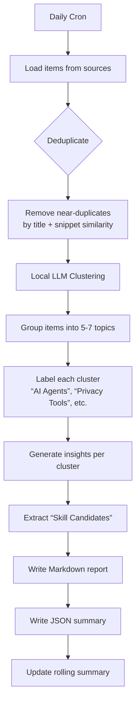

# Workflow: Trends Digest

Daily clustering of news/RSS items into top trends and skill‑candidate suggestions.

## Input
List of items (from RSS feeds, Twitter digests, newsletters) with:
- `title` (str)
- `url` (str)
- `date` (ISO 8601)
- `source` (e.g., "twitter", "rss", "newsletter")
- `snippet` (optional, first 200 chars of content)

**Example JSON:**
```json
[
  {
    "title": "OpenAI releases new multimodal agent API",
    "url": "https://example.com/...",
    "date": "2026‑02‑18",
    "source": "twitter",
    "snippet": "OpenAI's new API allows agents to see, hear, and interact..."
  }
]
```

## Processing Pipeline



### Step 1 – Deduplication
- **Fuzzy matching:** Compare title + snippet using Levenshtein distance (threshold 0.8).
- **URL canonicalization:** Remove tracking params, normalize.
- **Time window:** Only items from last 48 hours.

### Step 2 – Clustering (local LLM)
**Prompt to LLM:**
```
Group the following news items into 5‑7 topical clusters.
For each cluster, provide:
- A short label (2‑4 words)
- 3‑bullet summary of the common theme
- List of item IDs belonging to this cluster

Items:
1. [title]: [snippet]
2. ...
```

**Output parsing:** Expect JSON with `clusters: [ {label, summary, items} ]`.

**Fallback:** If LLM fails, use simple keyword‑based grouping (TF‑IDF + cosine similarity).

### Step 3 – Top Trends
For each cluster, compute:
- **Recency score:** newer items → higher weight.
- **Source diversity:** points if items come from multiple sources.
- **Volume:** number of items in cluster.

Rank clusters by weighted score, pick top 5.

### Step 4 – Skill Candidates
Identify patterns that could be automated as OpenClaw skills.

**Criteria for skill candidate:**
- Recurring theme (appears in multiple days/weeks).
- Actionable: can be automated via API, scraping, or script.
- High value: saves time, provides insights, or integrates data.

**LLM prompt:**
```
Based on these clusters, suggest 2‑3 OpenClaw skills.
For each skill provide:
- Name (short, descriptive)
- Objective (what it does)
- Inputs (data sources)
- Outputs (reports, alerts, actions)
- Sources (where data comes from)
- Risks/costs (time, API limits, complexity)
```

### Step 5 – Report Generation
**Markdown (`reports/trends/daily/YYYY‑MM‑DD.md`):**
```markdown
# Trends Digest – 2026‑02‑18

## Top 5 Clusters

### 1. AI Agent Frameworks
- Summary: New frameworks for building autonomous agents...
- Items:
  - [OpenAI agent API](url)
  - [LangChain 0.2 release](url)

### 2. Privacy‑first Search Tools
- ...

## 🛠️ Skill Candidates

### Skill: `agent‑benchmark‑tracker`
- **Objective:** Track releases and benchmarks of AI agent frameworks.
- **Inputs:** RSS feeds from AI labs, GitHub trending.
- **Outputs:** Weekly digest of new frameworks, performance comparisons.
- **Sources:** OpenAI blog, LangChain docs, arXiv.
- **Risks:** Fast‑moving field, high maintenance.

### Skill: `privacy‑search‑alert`
- ...
```

**JSON (`reports/trends/daily/YYYY‑MM‑DD.json`):**
```json
{
  "date": "2026‑02‑18",
  "clusters": [...],
  "skill_candidates": [...],
  "stats": {
    "total_items": 42,
    "unique_sources": 5,
    "llm_backend": "ollama"
  }
}
```

## Daily Sources
- Twitter RSS digest (already running)
- Newsletter digests (NYT, Hustle, TLDR, etc.)
- RSS feeds from tech blogs (to be configured)
- Manual input via Slack (future)

## Configuration
```yaml
trends_digest:
  sources:
    - type: "twitter_digest"
      path: "reports/twitter/daily/latest.json"
    - type: "newsletter"
      path: "reports/newsletter/daily/latest.json"
  llm:
    backend: "local_llm"
    max_items: 50
  output:
    markdown: "reports/trends/daily/{date}.md"
    json: "reports/trends/daily/{date}.json"
    rolling: "reports/trends/weekly/latest.md"
```

## Cron Schedule
- **Time:** 10:00 UTC (07:00 Montevideo)
- **Frequency:** Daily, Monday–Friday
- **Timeout:** 15 minutes

## Integration Points
- **Upstream:** Twitter RSS digest, newsletter‑digest skill.
- **Downstream:** Slack alert for high‑impact trends, skill‑creation backlog.
- **Memory:** Store clusters in `memory/trends/` for longitudinal analysis.

## Fallbacks & Robustness
- **LLM unavailable:** Use keyword‑based clustering (TF‑IDF).
- **No new items:** Write minimal report “No significant trends today”.
- **Source failure:** Continue with remaining sources, log warning.

## Success Metrics
- ✅ Report generated daily without human intervention.
- ✅ Clusters are coherent (manual spot‑check).
- ✅ Skill candidates are actionable (≥1 implemented per month).
- ✅ Rolling summary updated correctly.

---
*Workflow version: 1.0 | Last updated: 2026‑02‑19*